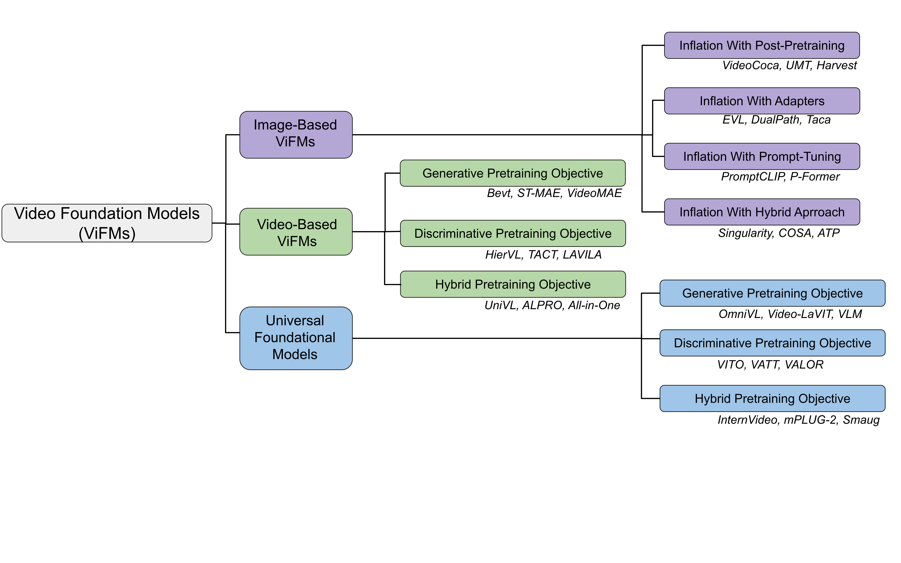

# Foundation Models for Video Understanding: A Survey

&nbsp;

# Menu

- [Image-based Video Foundation Models](#Image-based)
- [Video-based Video Foundation Models](#Video-based)
- [Universal Foundation Models](#Universal)

# Image-based
**Distilling Vision-Language Models on Millions of Videos.** _(Distill-VLM)_. [CVPR, 2024].  
*Yue Zhao, Long Zhao, Xingyi Zhou, Jialin Wu, Chun-Te Chu, Hui Miao, Florian Schroff, Hartwig Adam, Ting Liu, Boqing Gong, Philipp Krähenbühl, Liangzhe Yuan.* 
[[Paper](https://arxiv.org/pdf/2401.06129.pdf)] 

**COSA: Concatenated Sample Pretrained Vision-Language Foundation Model.** _(COSA)_. [ICLR, 2024].  
*Sihan Chen, Xingjian He, Handong Li, Xiaojie Jin, Jiashi Feng, Jing Liu.* 
[[Paper](https://openreview.net/pdf?id=bDkisS75zy)] [[Code](https://github.com/TXH-mercury/COSA)]
 
**Revealing Single Frame Bias for Video-and-Language Learning.** _(Singularity)_. [ACL, 2023].  
*Jie Lei, Tamara L Berg, Mohit Bansal.* 
[[Paper](https://aclanthology.org/2023.acl-long.29.pdf)] [[Code](https://github.com/jayleicn/singularity)]
 
**RTQ: Rethinking Video-language Understanding Based on Image-text Model.** _(RTQ)_. [ACM Multimedia, 2023].  
*Kunchang Li, Yali Wang, Yizhuo Li, Yi Wang, Yinan He, Limin Wang, Yu Qiao.* 
[[Paper](https://dl.acm.org/doi/pdf/10.1145/3581783.3612152)] [[Code](https://github.com/SCZwangxiao/RTQ-MM2023)]
 
**Dual-path Adaptation from Image to Video Transformers.** _(DualPath)_. [CVPR, 2023].  
*Jungin Park, Jiyoung Lee, Kwanghoon Sohn.* 
[[Paper](https://openaccess.thecvf.com/content/CVPR2023/papers/Park_Dual-Path_Adaptation_From_Image_to_Video_Transformers_CVPR_2023_paper.pdf)] [[Code](https://github.com/park-jungin/DualPath.git)]
 
**Unmasked Teacher: Towards Training-Efficient Video Foundation Models.** _(UMT)_. [ICCV, 2023].  
*Kunchang Li, Yali Wang, Yizhuo Li, Yi Wang, Yinan He, Limin Wang, Yu Qiao.* 
[[Paper](https://openaccess.thecvf.com/content/ICCV2023/papers/Li_Unmasked_Teacher_Towards_Training-Efficient_Video_Foundation_Models_ICCV_2023_paper.pdf)] [[Code](https://github.com/OpenGVLab/unmasked_teacher.git)]
 
**Disentangling Spatial and Temporal Learning for Efficient Image-to-Video Transfer Learning.** _(DiST)_. [ICCV, 2023].  
*Zhiwu Qing, Shiwei Zhang, Ziyuan Huang, Yingya Zhang, Changxin Gao, Deli Zhao, Nong Sang.* 
[[Paper](https://openaccess.thecvf.com/content/ICCV2023/papers/Qing_Disentangling_Spatial_and_Temporal_Learning_for_Efficient_Image-to-Video_Transfer_Learning_ICCV_2023_paper.pdf)] [[Code](https://github.com/alibaba-mmai-research/DiST)]

**Alignment and Generation Adapter for Efficient Video-text Understanding.** _(AG-Adapter)_. [ICCVW, 2023].  
*Han Fang; Zhifei Yang; Yuhan Wei; Xianghao Zang; Chao Ban; Zerun Feng; Zhongjiang He; Yongxiang Li; Hao Sun.* 
[[Paper](https://openaccess.thecvf.com/content/ICCV2023W/CLVL/papers/Fang_Alignment_and_Generation_Adapter_for_Efficient_Video-Text_Understanding_ICCVW_2023_paper.pdf)] 
 
**CLIP-ViP: Adapting Pre-trained Image-Text Model to Video-Language Representation Alignment.** _(CLIP-ViP)_. [ICLR, 2023].  
*Hongwei Xue, Yuchong Sun, Bei Liu, Jianlong Fu, Ruihua Song, Houqiang Li, Jiebo Luo.* 
[[Paper](https://arxiv.org/pdf/2209.06430.pdf)] [[Code](https://github.com/microsoft/XPretrain/tree/main/CLIP-ViP)]

**Bootstrapping Vision-Language Learning with Decoupled Language Pre-training.** _(P-Former)_. [NeurIPS, 2023].  
*Yiren Jian, Chongyang Gao, Soroush Vosoughi.* 
[[Paper](https://openreview.net/pdf?id=8Kch0ILfQH)] [[Code](https://github.com/yiren-jian/BLIText)]
 
**MaMMUT: A Simple Architecture for Joint Learning for MultiModal Tasks.** _(MaMMUT)_. [TMLR, 2023].  
*Weicheng Kuo, AJ Piergiovanni, Dahun Kim, Xiyang Luo, Ben Caine, Wei Li, Abhijit Ogale, Luowei Zhou, Andrew Dai, Zhifeng Chen, Claire Cui, Anelia Angelova.* 
[[Paper](https://openreview.net/pdf?id=FqOG4osY7C)] [[Code](https://github.com/lucidrains/MaMMUT-pytorch)]
 
**Harvest Video Foundation Models via Efficient Post-Pretraining.** _(Harvest)_. [arxiv, 2023].  
*Yizhuo Li, Kunchang Li, Yinan He, Yi Wang, Yali Wang, Limin Wang, Yu Qiao, Ping Luo.* 
[[Paper](https://arxiv.org/pdf/2310.19554.pdf)] [[Code](https://github.com/OpenGVLab/InternVideo)]

**TaCA: Upgrading Your Visual Foundation Model with Task-agnostic Compatible Adapter.** _(TaCA)_. [arxiv, 2023].  
*Binjie Zhang, Yixiao Ge, Xuyuan Xu, Ying Shan, Mike Zheng Shou.* 
[[Paper](https://arxiv.org/pdf/2306.12642)] 

**PaLM2-VAdapter: Progressively Aligned Language Model Makes a Strong Vision-language Adapter.** _(PaLM2-VAdapter)_. [arxiv, 2023].  
*Junfei Xiao, Zheng Xu, Alan Yuille, Shen Yan, Boyu Wang.* 
[[Paper](https://arxiv.org/pdf/2402.10896)] 

**Videoprompter: an ensemble of foundational models for zero-shot video understanding.** _(Videoprompter)_. [arxiv, 2023].  
*Adeel Yousaf, Muzammal Naseer, Salman Khan, Fahad Shahbaz Khan, Mubarak Shah.* 
[[Paper](https://arxiv.org/pdf/2310.15324)] 
 
**FitCLIP: Refining Large-Scale Pretrained Image-Text Models for Zero-Shot Video Understanding Tasks.** _(FitCLIP)_. [BMVC, 2022].  
*Santiago Castro and Fabian Caba.* 
[[Paper](https://bmvc2022.mpi-inf.mpg.de/0939.pdf)] [[Code](https://github.com/bryant1410/fitclip)]

**Revisiting the "Video" in Video-Language Understanding.** _(ATP)_. [CVPR, 2022].  
*Shyamal Buch, Cristóbal Eyzaguirre, Adrien Gaidon, Jiajun Wu, Li Fei-Fei, Juan Carlos Niebles.* 
[[Paper](https://openaccess.thecvf.com/content/CVPR2022/papers/Buch_Revisiting_the_Video_in_Video-Language_Understanding_CVPR_2022_paper.pdf)] [[Code](https://github.com/StanfordVL/atp-video-language)]
 
**Frozen CLIP models are Efficient Video Learners.**  _(EVL)_. [ECCV, 2022].  
*Ziyi Lin, Shijie Geng, Renrui Zhang, Peng Gao, Gerard de Melo, Xiaogang Wang, Jifeng Dai, Yu Qiao, Hongsheng Li.* 
 [[Paper](https://arxiv.org/pdf/2208.03550.pdf)] [[Code](https://github.com/OpenGVLab/efficient-video-recognition.git)]

**Prompting Visual-Language Models for Efficient Video Understanding.** _(Prompt-CLIP)_. [ECCV, 2022].  
*Chen Ju, Tengda Han, Kunhao Zheng, Ya Zhang, Weidi Xie.* 
 [[Paper](https://www.ecva.net/papers/eccv_2022/papers_ECCV/papers/136950104.pdf)] [[Code](https://github.com/ju-chen/Efficient-Prompt)]
 
**VideoCoCa: Video-Text Modeling with Zero-Shot Transfer from Contrastive Captioners.** _(Video-CoCa)_. [arxiv, 2022].  
*Shen Yan, Tao Zhu, Zirui Wang, Yuan Cao, Mi Zhang, Soham Ghosh, Yonghui Wu, Jiahui Yu.* 
 [[Paper](https://arxiv.org/pdf/2212.04979.pdf)] 

# Video-based
**InternVid: A Large-scale Video-Text Dataset for Multimodal Understanding and Generation.** _(ViCLIP)_. [ICLR, 2024].  
*Yi Wang, Yinan He, Yizhuo Li, Kunchang Li, Jiashuo Yu, Xin Ma, Xinhao Li, Guo Chen, Xinyuan Chen, Yaohui Wang, Ping Luo, Ziwei Liu, Yali Wang, Limin Wang, Yu Qiao* 
[[Paper](https://openreview.net/pdf?id=MLBdiWu4Fw)] [[Code](https://github.com/OpenGVLab/InternVideo/tree/main/Data/InternVid)]

**All in One: Exploring Unified Video-Language Pre-training.** _(All-in-One)_. [CVPR, 2023].  
*Alex Jinpeng Wang, Yixiao Ge, Rui Yan, Yuying Ge, Xudong Lin, Guanyu Cai, Jianping Wu, Ying Shan, Xiaohu Qie, Mike Zheng Shou* 
[[Paper](https://openaccess.thecvf.com/content/CVPR2023/papers/Wang_All_in_One_Exploring_Unified_Video-Language_Pre-Training_CVPR_2023_paper.pdf)] [[Code](https://github.com/showlab/all-in-one)]

**Clover: Towards A Unified Video-Language Alignment and Fusion Model.** _(Clover)_. [CVPR, 2023].  
*Jingjia Huang, Yinan Li, Jiashi Feng, Xinglong Wu, Xiaoshuai Sun, Rongrong Ji* 
[[Paper](https://openaccess.thecvf.com/content/CVPR2023/papers/Huang_Clover_Towards_a_Unified_Video-Language_Alignment_and_Fusion_Model_CVPR_2023_paper.pdf)] [[Code](https://github.com/LeeYN-43/Clover)]

**HierVL: Learning Hierarchical Video-Language Embeddings.** _(HierVL)_. [CVPR, 2023].  
*Kumar Ashutosh, Rohit Girdhar, Lorenzo Torresani, Kristen Grauman* 
[[Paper](https://openaccess.thecvf.com/content/CVPR2023/papers/Ashutosh_HierVL_Learning_Hierarchical_Video-Language_Embeddings_CVPR_2023_paper.pdf)] [[Code](https://github.com/facebookresearch/HierVL)]

**LAVENDER: Unifying Video-Language Understanding as Masked Language Modeling.** _(LAVENDER)_. [CVPR, 2023].  
*Linjie Li, Zhe Gan, Kevin Lin, Chung-Ching Lin, Zicheng Liu, Ce Liu, Lijuan Wang* 
[[Paper](https://openaccess.thecvf.com/content/CVPR2023/papers/Li_LAVENDER_Unifying_Video-Language_Understanding_As_Masked_Language_Modeling_CVPR_2023_paper.pdf)] [[Code](https://github.com/microsoft/LAVENDER)]

**Learning Video Representations from Large Language Models.** _(LaViLa)_. [CVPR, 2023].  
*Yue Zhao, Ishan Misra, Philipp Krähenbühl, Rohit Girdhar* 
[[Paper](https://openaccess.thecvf.com/content/CVPR2023/papers/Zhao_Learning_Video_Representations_From_Large_Language_Models_CVPR_2023_paper.pdf)] [[Code](https://github.com/facebookresearch/LaViLa)]

**Masked Video Distillation: Rethinking Masked Feature Modeling for Self-supervised Video Representation Learning.** _(MVD)_. [CVPR, 2023].  
*Rui Wang, Dongdong Chen, Zuxuan Wu, Yinpeng Chen, Xiyang Dai, Mengchen Liu, Lu Yuan, Yu-Gang Jiang* 
[[Paper](https://openaccess.thecvf.com/content/CVPR2023/papers/Wang_Masked_Video_Distillation_Rethinking_Masked_Feature_Modeling_for_Self-Supervised_Video_CVPR_2023_paper.pdf)] [[Code](https://github.com/ruiwang2021/mvd)]

**Tell Me What Happened: Unifying Text-guided Video Completion via Multimodal Masked Video Generation.** _(MMVG)_. [CVPR, 2023].  
*Linjie Li, Zhe Gan, Kevin Lin, Chung-Ching Lin, Zicheng Liu, Ce Liu, Lijuan Wang* 
[[Paper](https://openaccess.thecvf.com/content/CVPR2023/papers/Fu_Tell_Me_What_Happened_Unifying_Text-Guided_Video_Completion_via_Multimodal_CVPR_2023_paper.pdf)] [[Code](https://github.com/tsujuifu/pytorch_tvc)]

**Test of Time: Instilling Video-Language Models with a Sense of Time.** _(TACT)_. [CVPR, 2023].  
*Piyush Bagad, Makarand Tapaswi, Cees G. M. Snoek* 
[[Paper](https://openaccess.thecvf.com/content/CVPR2023/papers/Bagad_Test_of_Time_Instilling_Video-Language_Models_With_a_Sense_of_CVPR_2023_paper.pdf)] [[Code](https://github.com/bpiyush/TestOfTime)]
 
**VideoMAE V2: Scaling Video Masked Autoencoders with Dual Masking.** _(VideoMAEv2)_. [CVPR, 2023].  
*Tsu-Jui Fu, Licheng Yu, Ning Zhang, Cheng-Yang Fu, Jong-Chyi Su, William Yang Wang, Sean Bell* 
[[Paper](https://openaccess.thecvf.com/content/CVPR2023/papers/Wang_VideoMAE_V2_Scaling_Video_Masked_Autoencoders_With_Dual_Masking_CVPR_2023_paper.pdf)] [[Code](https://github.com/OpenGVLab/VideoMAEv2)]

**Audiovisual Masked Autoencoders.** _(AudVis MAE)_. [ICCV, 2023].  
*Mariana-Iuliana Georgescu, Eduardo Fonseca, Radu Tudor Ionescu, Mario Lucic, Cordelia Schmid, Anurag Arnab* 
[[Paper](https://openaccess.thecvf.com/content/ICCV2023/papers/Georgescu_Audiovisual_Masked_Autoencoders_ICCV_2023_paper.pdf)]

**HiTeA: Hierarchical Temporal-Aware Video-Language Pre-training.** _(Hitea)_. [ICCV, 2023].  
*Qinghao Ye, Guohai Xu, Ming Yan, Haiyang Xu, Qi Qian, Ji Zhang, Fei Huang* 
[[Paper](https://openaccess.thecvf.com/content/ICCV2023/papers/Ye_HiTeA_Hierarchical_Temporal-Aware_Video-Language_Pre-training_ICCV_2023_paper.pdf)]

**MGMAE: Motion Guided Masking for Video Masked Autoencoding.** _(MGMAE)_. [ICCV, 2023].  
*Bingkun Huang, Zhiyu Zhao, Guozhen Zhang, Yu Qiao, Limin Wang* 
[[Paper](https://openaccess.thecvf.com/content/ICCV2023/papers/Huang_MGMAE_Motion_Guided_Masking_for_Video_Masked_Autoencoding_ICCV_2023_paper.pdf)] [[Code](https://github.com/MCG-NJU/MGMAE)]

**Verbs in Action: Improving verb understanding in video-language models.** _(VFC)_. [ICCV, 2023].  
*Liliane Momeni, Mathilde Caron, Arsha Nagrani, Andrew Zisserman, Cordelia Schmid* 
[[Paper](https://openaccess.thecvf.com/content/ICCV2023/papers/Momeni_Verbs_in_Action_Improving_Verb_Understanding_in_Video-Language_Models_ICCV_2023_paper.pdf)] [[Code](https://github.com/google-research/scenic/tree/main/scenic/projects/verbs_in_action)]

**Paxion: Patching Action Knowledge in Video-Language Foundation Models.** _(PAXION)_. [NeurIPS, 2023].  
*Zhenhailong Wang, Ansel Blume, Sha Li, Genglin Liu, Jaemin Cho, Zineng Tang, Mohit Bansal, Heng Ji* 
[[Paper](https://proceedings.neurips.cc/paper_files/paper/2023/file/420492060687ca7448398c4c3fa10366-Paper-Conference.pdf)] [[Code](https://github.com/MikeWangWZHL/Paxion)]

**Advancing High-Resolution Video-Language Representation with Large-Scale Video Transcriptions.** _(HD-VILA)_. [CVPR, 2022].  
*Hongwei Xue, Tiankai Hang, Yanhong Zeng, Yuchong Sun, Bei Liu, Huan Yang, Jianlong Fu, Baining Guo.* 
[[Paper](https://openaccess.thecvf.com/content/CVPR2022/papers/Xue_Advancing_High-Resolution_Video-Language_Representation_With_Large-Scale_Video_Transcriptions_CVPR_2022_paper.pdf)] [[Code](https://github.com/microsoft/XPretrain/tree/main/hd-vila)]

**Align and Prompt: Video-and-Language Pre-training with Entity Prompts.** _(ALPRO)_. [CVPR, 2022].  
*Dongxu Li, Junnan Li, Hongdong Li, Juan Carlos Niebles, Steven C.H. Hoi.* 
[[Paper](https://openaccess.thecvf.com/content/CVPR2022/papers/Li_Align_and_Prompt_Video-and-Language_Pre-Training_With_Entity_Prompts_CVPR_2022_paper.pdf)] [[Code](https://github.com/salesforce/ALPRO)]

**BEVT: BERT Pretraining of Video Transformers.** _(Bevt)_. [CVPR, 2022].  
*Rui Wang, Dongdong Chen, Zuxuan Wu, Yinpeng Chen, Xiyang Dai, Mengchen Liu, Yu-Gang Jiang, Luowei Zhou, Lu Yuan.* 
[[Paper](https://openaccess.thecvf.com/content/CVPR2022/papers/Wang_BEVT_BERT_Pretraining_of_Video_Transformers_CVPR_2022_paper.pdf)] [[Code](https://github.com/xyzforever/BEVT/tree/main)]

**Long-Form Video-Language Pre-Training with Multimodal Temporal Contrastive Learning.** _(LF-VILA)_. [NeurIPS, 2022].  
*Yuchong Sun, Hongwei Xue, Ruihua Song, Bei Liu, Huan Yang, Jianlong Fu* 
[[Paper](https://proceedings.neurips.cc/paper_files/paper/2022/file/f8290ccc2905538be1a7f7914ccef629-Paper-Conference.pdf)] [[Code](https://github.com/microsoft/XPretrain/tree/main/LF-VILA)]

**Masked Autoencoders As Spatiotemporal Learners.** _(ST-MAE)_. [NeurIPS, 2022].  
*Christoph Feichtenhofer, Haoqi Fan, Yanghao Li, Kaiming He* 
[[Paper](https://proceedings.neurips.cc/paper_files/paper/2022/file/e97d1081481a4017df96b51be31001d3-Paper-Conference.pdf)] [[Code](https://github.com/facebookresearch/mae_st)]

**VideoMAE: Masked Autoencoders are Data-Efficient Learners for Self-Supervised Video Pre-Training.** _(VideoMAE)_. [NeurIPS, 2022].  
*Zhan Tong, Yibing Song, Jue Wang, Limin Wang* 
[[Paper](https://proceedings.neurips.cc/paper_files/paper/2022/file/416f9cb3276121c42eebb86352a4354a-Paper-Conference.pdf)] [[Code](https://github.com/MCG-NJU/VideoMAE)]

**TVLT: Textless Vision-Language Transformer.** _(TVLT)_. [NeurIPS, 2022].  
*Zineng Tang, Jaemin Cho, Yixin Nie, Mohit Bansal* 
[[Paper](https://proceedings.neurips.cc/paper_files/paper/2022/file/3ea3134345f2e6228a29f35b86bce24d-Paper-Conference.pdf)] [[Code](https://github.com/zinengtang/TVLT)]

**It Takes Two: Masked Appearance-Motion Modeling for Self-supervised Video Transformer Pre-training.** _(MAM2)_. [arxiv, 2022].  
*Yuxin Song, Min Yang, Wenhao Wu, Dongliang He, Fu Li, Jingdong Wang* 
[[Paper](https://arxiv.org/pdf/2210.05234)] \

**SimVTP: Simple Video Text Pre-training with Masked Autoencoders.** _(SimVTP)_. [arxiv, 2022].  
*Yue Ma, Tianyu Yang, Yin Shan, Xiu Li* 
[[Paper](https://arxiv.org/pdf/2212.03490)] [[Code](https://github.com/Simoyuan/SimVTP)]

**VIOLET : End-to-End Video-Language Transformers with Masked Visual-token Modeling.** _(Violet)_. [arxiv, 2022].  
*Tsu-Jui Fu, Linjie Li, Zhe Gan, Kevin Lin, William Yang Wang, Lijuan Wang, Zicheng Liu* 
[[Paper](https://arxiv.org/pdf/2111.12681)] [[Code](https://github.com/tsujuifu/pytorch_violet)]

**VideoCLIP: Contrastive Pre-training for Zero-shot Video-Text Understanding.** _(VideoCLIP)_. [EMNLP, 2021].  
*Hu Xu, Gargi Ghosh, Po-Yao Huang, Dmytro Okhonko, Armen Aghajanyan, Florian Metze, Luke Zettlemoyer, Christoph Feichtenhofer* 
[[Paper](https://aclanthology.org/2021.emnlp-main.544.pdf)] [[Code](https://github.com/facebookresearch/fairseq/tree/main/examples/MMPT)]

**VIMPAC: Video Pre-Training via Masked Token Prediction and Contrastive Learning.** _(Vimpac)_. [arxiv, 2021].  
*Hao Tan, Jie Lei, Thomas Wolf, Mohit Bansal* 
[[Paper](https://arxiv.org/pdf/2106.11250)] [[Code](https://github.com/airsplay/vimpac)]

**UniVL: A Unified Video and Language Pre-Training Model for Multimodal Understanding and Generation.** _(UniVL)_. [arxiv, 2020].  
*Huaishao Luo, Lei Ji, Botian Shi, Haoyang Huang, Nan Duan, Tianrui Li, Jason Li, Taroon Bharti, Ming Zhou* 
[[Paper](https://arxiv.org/pdf/2002.06353)] [[Code](https://github.com/microsoft/UniVL)]

# Universal
