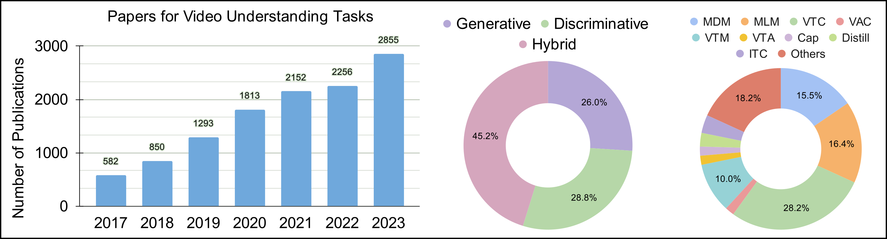
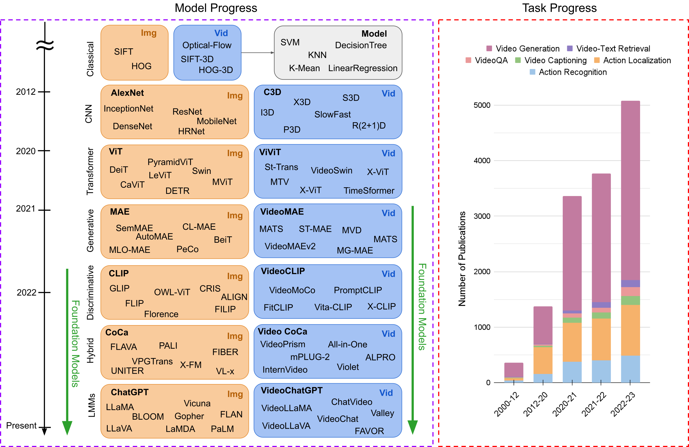
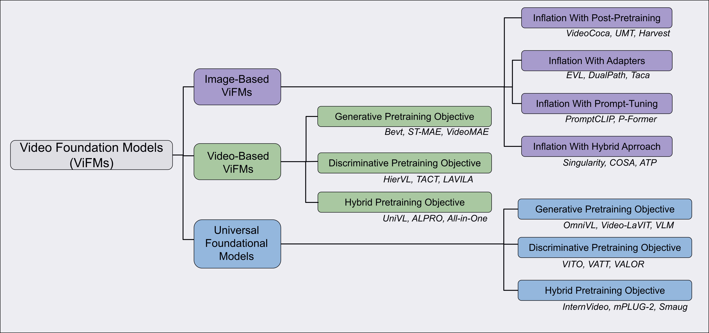

# [[Foundation Models for Video Understanding: A Survey](https://arxiv.org/pdf/2405.03770)]

&nbsp;

The field of video understanding is undergoing significant advancement, as evidenced by the increasing number of research publications focused on various video understanding tasks (Figure below). This growth coincides with the development of large-scale pretraining techniques. These techniques have demonstrated remarkable capabilities in adapting to diverse tasks, requiring minimal additional training with robust generalization. As a result, researchers are actively investigating the role of these foundational models to address a broad spectrum of video understanding challenges. We surveyed more than 200 foundation models, analyzing their performance over several common video tasks. Our survey, [[Foundation Model for Video Understanding: A Survey](https://arxiv.org/pdf/2405.03770)], also provides an overview of 16 different video tasks, including their benchmarks and evaluation metrics.

## Classification

# Menu

- [Image-based Video Foundation Models](#Image-based)
- [Video-based Video Foundation Models](#Video-based)
- [Universal Foundation Models](#Universal)

# Image-based
**Distilling Vision-Language Models on Millions of Videos.** _(Distill-VLM)_. [CVPR, 2024].  
*Yue Zhao, Long Zhao, Xingyi Zhou, Jialin Wu, Chun-Te Chu, Hui Miao, Florian Schroff, Hartwig Adam, Ting Liu, Boqing Gong, Philipp Krähenbühl, Liangzhe Yuan.* 
[[Paper](https://arxiv.org/pdf/2401.06129.pdf)] 

**COSA: Concatenated Sample Pretrained Vision-Language Foundation Model.** _(COSA)_. [ICLR, 2024].  
*Sihan Chen, Xingjian He, Handong Li, Xiaojie Jin, Jiashi Feng, Jing Liu.* 
[[Paper](https://openreview.net/pdf?id=bDkisS75zy)] [[Code](https://github.com/TXH-mercury/COSA)]
 
**Revealing Single Frame Bias for Video-and-Language Learning.** _(Singularity)_. [ACL, 2023].  
*Jie Lei, Tamara L Berg, Mohit Bansal.* 
[[Paper](https://aclanthology.org/2023.acl-long.29.pdf)] [[Code](https://github.com/jayleicn/singularity)]
 
**RTQ: Rethinking Video-language Understanding Based on Image-text Model.** _(RTQ)_. [ACM Multimedia, 2023].  
*Kunchang Li, Yali Wang, Yizhuo Li, Yi Wang, Yinan He, Limin Wang, Yu Qiao.* 
[[Paper](https://dl.acm.org/doi/pdf/10.1145/3581783.3612152)] [[Code](https://github.com/SCZwangxiao/RTQ-MM2023)]
 
**Dual-path Adaptation from Image to Video Transformers.** _(DualPath)_. [CVPR, 2023].  
*Jungin Park, Jiyoung Lee, Kwanghoon Sohn.* 
[[Paper](https://openaccess.thecvf.com/content/CVPR2023/papers/Park_Dual-Path_Adaptation_From_Image_to_Video_Transformers_CVPR_2023_paper.pdf)] [[Code](https://github.com/park-jungin/DualPath.git)]
 
**Unmasked Teacher: Towards Training-Efficient Video Foundation Models.** _(UMT)_. [ICCV, 2023].  
*Kunchang Li, Yali Wang, Yizhuo Li, Yi Wang, Yinan He, Limin Wang, Yu Qiao.* 
[[Paper](https://openaccess.thecvf.com/content/ICCV2023/papers/Li_Unmasked_Teacher_Towards_Training-Efficient_Video_Foundation_Models_ICCV_2023_paper.pdf)] [[Code](https://github.com/OpenGVLab/unmasked_teacher.git)]
 
**Disentangling Spatial and Temporal Learning for Efficient Image-to-Video Transfer Learning.** _(DiST)_. [ICCV, 2023].  
*Zhiwu Qing, Shiwei Zhang, Ziyuan Huang, Yingya Zhang, Changxin Gao, Deli Zhao, Nong Sang.* 
[[Paper](https://openaccess.thecvf.com/content/ICCV2023/papers/Qing_Disentangling_Spatial_and_Temporal_Learning_for_Efficient_Image-to-Video_Transfer_Learning_ICCV_2023_paper.pdf)] [[Code](https://github.com/alibaba-mmai-research/DiST)]

**Alignment and Generation Adapter for Efficient Video-text Understanding.** _(AG-Adapter)_. [ICCVW, 2023].  
*Han Fang; Zhifei Yang; Yuhan Wei; Xianghao Zang; Chao Ban; Zerun Feng; Zhongjiang He; Yongxiang Li; Hao Sun.* 
[[Paper](https://openaccess.thecvf.com/content/ICCV2023W/CLVL/papers/Fang_Alignment_and_Generation_Adapter_for_Efficient_Video-Text_Understanding_ICCVW_2023_paper.pdf)] 
 
**CLIP-ViP: Adapting Pre-trained Image-Text Model to Video-Language Representation Alignment.** _(CLIP-ViP)_. [ICLR, 2023].  
*Hongwei Xue, Yuchong Sun, Bei Liu, Jianlong Fu, Ruihua Song, Houqiang Li, Jiebo Luo.* 
[[Paper](https://arxiv.org/pdf/2209.06430.pdf)] [[Code](https://github.com/microsoft/XPretrain/tree/main/CLIP-ViP)]

**Bootstrapping Vision-Language Learning with Decoupled Language Pre-training.** _(P-Former)_. [NeurIPS, 2023].  
*Yiren Jian, Chongyang Gao, Soroush Vosoughi.* 
[[Paper](https://openreview.net/pdf?id=8Kch0ILfQH)] [[Code](https://github.com/yiren-jian/BLIText)]
 
**MaMMUT: A Simple Architecture for Joint Learning for MultiModal Tasks.** _(MaMMUT)_. [TMLR, 2023].  
*Weicheng Kuo, AJ Piergiovanni, Dahun Kim, Xiyang Luo, Ben Caine, Wei Li, Abhijit Ogale, Luowei Zhou, Andrew Dai, Zhifeng Chen, Claire Cui, Anelia Angelova.* 
[[Paper](https://openreview.net/pdf?id=FqOG4osY7C)] [[Code](https://github.com/lucidrains/MaMMUT-pytorch)]
 
**Harvest Video Foundation Models via Efficient Post-Pretraining.** _(Harvest)_. [arxiv, 2023].  
*Yizhuo Li, Kunchang Li, Yinan He, Yi Wang, Yali Wang, Limin Wang, Yu Qiao, Ping Luo.* 
[[Paper](https://arxiv.org/pdf/2310.19554.pdf)] [[Code](https://github.com/OpenGVLab/InternVideo)]

**TaCA: Upgrading Your Visual Foundation Model with Task-agnostic Compatible Adapter.** _(TaCA)_. [arxiv, 2023].  
*Binjie Zhang, Yixiao Ge, Xuyuan Xu, Ying Shan, Mike Zheng Shou.* 
[[Paper](https://arxiv.org/pdf/2306.12642)] 

**PaLM2-VAdapter: Progressively Aligned Language Model Makes a Strong Vision-language Adapter.** _(PaLM2-VAdapter)_. [arxiv, 2023].  
*Junfei Xiao, Zheng Xu, Alan Yuille, Shen Yan, Boyu Wang.* 
[[Paper](https://arxiv.org/pdf/2402.10896)] 

**Videoprompter: an ensemble of foundational models for zero-shot video understanding.** _(Videoprompter)_. [arxiv, 2023].  
*Adeel Yousaf, Muzammal Naseer, Salman Khan, Fahad Shahbaz Khan, Mubarak Shah.* 
[[Paper](https://arxiv.org/pdf/2310.15324)] 
 
**FitCLIP: Refining Large-Scale Pretrained Image-Text Models for Zero-Shot Video Understanding Tasks.** _(FitCLIP)_. [BMVC, 2022].  
*Santiago Castro and Fabian Caba.* 
[[Paper](https://bmvc2022.mpi-inf.mpg.de/0939.pdf)] [[Code](https://github.com/bryant1410/fitclip)]

**Revisiting the "Video" in Video-Language Understanding.** _(ATP)_. [CVPR, 2022].  
*Shyamal Buch, Cristóbal Eyzaguirre, Adrien Gaidon, Jiajun Wu, Li Fei-Fei, Juan Carlos Niebles.* 
[[Paper](https://openaccess.thecvf.com/content/CVPR2022/papers/Buch_Revisiting_the_Video_in_Video-Language_Understanding_CVPR_2022_paper.pdf)] [[Code](https://github.com/StanfordVL/atp-video-language)]
 
**Frozen CLIP models are Efficient Video Learners.**  _(EVL)_. [ECCV, 2022].  
*Ziyi Lin, Shijie Geng, Renrui Zhang, Peng Gao, Gerard de Melo, Xiaogang Wang, Jifeng Dai, Yu Qiao, Hongsheng Li.* 
 [[Paper](https://arxiv.org/pdf/2208.03550.pdf)] [[Code](https://github.com/OpenGVLab/efficient-video-recognition.git)]

**Prompting Visual-Language Models for Efficient Video Understanding.** _(Prompt-CLIP)_. [ECCV, 2022].  
*Chen Ju, Tengda Han, Kunhao Zheng, Ya Zhang, Weidi Xie.* 
 [[Paper](https://www.ecva.net/papers/eccv_2022/papers_ECCV/papers/136950104.pdf)] [[Code](https://github.com/ju-chen/Efficient-Prompt)]
 
**VideoCoCa: Video-Text Modeling with Zero-Shot Transfer from Contrastive Captioners.** _(Video-CoCa)_. [arxiv, 2022].  
*Shen Yan, Tao Zhu, Zirui Wang, Yuan Cao, Mi Zhang, Soham Ghosh, Yonghui Wu, Jiahui Yu.* 
 [[Paper](https://arxiv.org/pdf/2212.04979.pdf)] 

# Video-based
**InternVid: A Large-scale Video-Text Dataset for Multimodal Understanding and Generation.** _(ViCLIP)_. [ICLR, 2024].  
*Yi Wang, Yinan He, Yizhuo Li, Kunchang Li, Jiashuo Yu, Xin Ma, Xinhao Li, Guo Chen, Xinyuan Chen, Yaohui Wang, Ping Luo, Ziwei Liu, Yali Wang, Limin Wang, Yu Qiao* 
[[Paper](https://openreview.net/pdf?id=MLBdiWu4Fw)] [[Code](https://github.com/OpenGVLab/InternVideo/tree/main/Data/InternVid)]

**All in One: Exploring Unified Video-Language Pre-training.** _(All-in-One)_. [CVPR, 2023].  
*Alex Jinpeng Wang, Yixiao Ge, Rui Yan, Yuying Ge, Xudong Lin, Guanyu Cai, Jianping Wu, Ying Shan, Xiaohu Qie, Mike Zheng Shou* 
[[Paper](https://openaccess.thecvf.com/content/CVPR2023/papers/Wang_All_in_One_Exploring_Unified_Video-Language_Pre-Training_CVPR_2023_paper.pdf)] [[Code](https://github.com/showlab/all-in-one)]

**Clover: Towards A Unified Video-Language Alignment and Fusion Model.** _(Clover)_. [CVPR, 2023].  
*Jingjia Huang, Yinan Li, Jiashi Feng, Xinglong Wu, Xiaoshuai Sun, Rongrong Ji* 
[[Paper](https://openaccess.thecvf.com/content/CVPR2023/papers/Huang_Clover_Towards_a_Unified_Video-Language_Alignment_and_Fusion_Model_CVPR_2023_paper.pdf)] [[Code](https://github.com/LeeYN-43/Clover)]

**HierVL: Learning Hierarchical Video-Language Embeddings.** _(HierVL)_. [CVPR, 2023].  
*Kumar Ashutosh, Rohit Girdhar, Lorenzo Torresani, Kristen Grauman* 
[[Paper](https://openaccess.thecvf.com/content/CVPR2023/papers/Ashutosh_HierVL_Learning_Hierarchical_Video-Language_Embeddings_CVPR_2023_paper.pdf)] [[Code](https://github.com/facebookresearch/HierVL)]

**LAVENDER: Unifying Video-Language Understanding as Masked Language Modeling.** _(LAVENDER)_. [CVPR, 2023].  
*Linjie Li, Zhe Gan, Kevin Lin, Chung-Ching Lin, Zicheng Liu, Ce Liu, Lijuan Wang* 
[[Paper](https://openaccess.thecvf.com/content/CVPR2023/papers/Li_LAVENDER_Unifying_Video-Language_Understanding_As_Masked_Language_Modeling_CVPR_2023_paper.pdf)] [[Code](https://github.com/microsoft/LAVENDER)]

**Learning Video Representations from Large Language Models.** _(LaViLa)_. [CVPR, 2023].  
*Yue Zhao, Ishan Misra, Philipp Krähenbühl, Rohit Girdhar* 
[[Paper](https://openaccess.thecvf.com/content/CVPR2023/papers/Zhao_Learning_Video_Representations_From_Large_Language_Models_CVPR_2023_paper.pdf)] [[Code](https://github.com/facebookresearch/LaViLa)]

**Masked Video Distillation: Rethinking Masked Feature Modeling for Self-supervised Video Representation Learning.** _(MVD)_. [CVPR, 2023].  
*Rui Wang, Dongdong Chen, Zuxuan Wu, Yinpeng Chen, Xiyang Dai, Mengchen Liu, Lu Yuan, Yu-Gang Jiang* 
[[Paper](https://openaccess.thecvf.com/content/CVPR2023/papers/Wang_Masked_Video_Distillation_Rethinking_Masked_Feature_Modeling_for_Self-Supervised_Video_CVPR_2023_paper.pdf)] [[Code](https://github.com/ruiwang2021/mvd)]

**Tell Me What Happened: Unifying Text-guided Video Completion via Multimodal Masked Video Generation.** _(MMVG)_. [CVPR, 2023].  
*Linjie Li, Zhe Gan, Kevin Lin, Chung-Ching Lin, Zicheng Liu, Ce Liu, Lijuan Wang* 
[[Paper](https://openaccess.thecvf.com/content/CVPR2023/papers/Fu_Tell_Me_What_Happened_Unifying_Text-Guided_Video_Completion_via_Multimodal_CVPR_2023_paper.pdf)] [[Code](https://github.com/tsujuifu/pytorch_tvc)]

**Test of Time: Instilling Video-Language Models with a Sense of Time.** _(TACT)_. [CVPR, 2023].  
*Piyush Bagad, Makarand Tapaswi, Cees G. M. Snoek* 
[[Paper](https://openaccess.thecvf.com/content/CVPR2023/papers/Bagad_Test_of_Time_Instilling_Video-Language_Models_With_a_Sense_of_CVPR_2023_paper.pdf)] [[Code](https://github.com/bpiyush/TestOfTime)]
 
**VideoMAE V2: Scaling Video Masked Autoencoders with Dual Masking.** _(VideoMAEv2)_. [CVPR, 2023].  
*Tsu-Jui Fu, Licheng Yu, Ning Zhang, Cheng-Yang Fu, Jong-Chyi Su, William Yang Wang, Sean Bell* 
[[Paper](https://openaccess.thecvf.com/content/CVPR2023/papers/Wang_VideoMAE_V2_Scaling_Video_Masked_Autoencoders_With_Dual_Masking_CVPR_2023_paper.pdf)] [[Code](https://github.com/OpenGVLab/VideoMAEv2)]

**VindLU: A Recipe for Effective Video-and-Language Pretraining.** _(VindLU)_. [CVPR, 2023].  
*Feng Cheng, Xizi Wang, Jie Lei, David Crandall, Mohit Bansal, Gedas Bertasius* 
[[Paper](https://openaccess.thecvf.com/content/CVPR2023/papers/Cheng_VindLU_A_Recipe_for_Effective_Video-and-Language_Pretraining_CVPR_2023_paper.pdf)] [[Code](https://github.com/klauscc/VindLU)]

**An Empirical Study of End-to-End Video-Language Transformers with Masked Visual Modeling.** _(Violetv2)_. [CVPR, 2023].  
*Tsu-Jui Fu, Linjie Li, Zhe Gan, Kevin Lin, William Yang Wang, Lijuan Wang, Zicheng Liu* 
[[Paper](https://openaccess.thecvf.com/content/CVPR2023/papers/Fu_An_Empirical_Study_of_End-to-End_Video-Language_Transformers_With_Masked_Visual_CVPR_2023_paper.pdf)] [[Code](https://github.com/tsujuifu/pytorch_empirical-mvm)]

**Audiovisual Masked Autoencoders.** _(AudVis MAE)_. [ICCV, 2023].  
*Mariana-Iuliana Georgescu, Eduardo Fonseca, Radu Tudor Ionescu, Mario Lucic, Cordelia Schmid, Anurag Arnab* 
[[Paper](https://openaccess.thecvf.com/content/ICCV2023/papers/Georgescu_Audiovisual_Masked_Autoencoders_ICCV_2023_paper.pdf)]

**HiTeA: Hierarchical Temporal-Aware Video-Language Pre-training.** _(Hitea)_. [ICCV, 2023].  
*Qinghao Ye, Guohai Xu, Ming Yan, Haiyang Xu, Qi Qian, Ji Zhang, Fei Huang* 
[[Paper](https://openaccess.thecvf.com/content/ICCV2023/papers/Ye_HiTeA_Hierarchical_Temporal-Aware_Video-Language_Pre-training_ICCV_2023_paper.pdf)]

**MGMAE: Motion Guided Masking for Video Masked Autoencoding.** _(MGMAE)_. [ICCV, 2023].  
*Bingkun Huang, Zhiyu Zhao, Guozhen Zhang, Yu Qiao, Limin Wang* 
[[Paper](https://openaccess.thecvf.com/content/ICCV2023/papers/Huang_MGMAE_Motion_Guided_Masking_for_Video_Masked_Autoencoding_ICCV_2023_paper.pdf)] [[Code](https://github.com/MCG-NJU/MGMAE)]

**Verbs in Action: Improving verb understanding in video-language models.** _(VFC)_. [ICCV, 2023].  
*Liliane Momeni, Mathilde Caron, Arsha Nagrani, Andrew Zisserman, Cordelia Schmid* 
[[Paper](https://openaccess.thecvf.com/content/ICCV2023/papers/Momeni_Verbs_in_Action_Improving_Verb_Understanding_in_Video-Language_Models_ICCV_2023_paper.pdf)] [[Code](https://github.com/google-research/scenic/tree/main/scenic/projects/verbs_in_action)]

**Paxion: Patching Action Knowledge in Video-Language Foundation Models.** _(PAXION)_. [NeurIPS, 2023].  
*Zhenhailong Wang, Ansel Blume, Sha Li, Genglin Liu, Jaemin Cho, Zineng Tang, Mohit Bansal, Heng Ji* 
[[Paper](https://proceedings.neurips.cc/paper_files/paper/2023/file/420492060687ca7448398c4c3fa10366-Paper-Conference.pdf)] [[Code](https://github.com/MikeWangWZHL/Paxion)]

**MuLTI: Efficient Video-and-Language Understanding with Text-Guided MultiWay-Sampler and Multiple Choice Modeling.** _(MuLTI)_. [arxiv, 2023].  
*Jiaqi Xu, Bo Liu, Yunkuo Chen, Mengli Cheng, Xing Shi* 
[[Paper](https://arxiv.org/pdf/2303.05707)] 

**Advancing High-Resolution Video-Language Representation with Large-Scale Video Transcriptions.** _(HD-VILA)_. [CVPR, 2022].  
*Hongwei Xue, Tiankai Hang, Yanhong Zeng, Yuchong Sun, Bei Liu, Huan Yang, Jianlong Fu, Baining Guo.* 
[[Paper](https://openaccess.thecvf.com/content/CVPR2022/papers/Xue_Advancing_High-Resolution_Video-Language_Representation_With_Large-Scale_Video_Transcriptions_CVPR_2022_paper.pdf)] [[Code](https://github.com/microsoft/XPretrain/tree/main/hd-vila)]

**Align and Prompt: Video-and-Language Pre-training with Entity Prompts.** _(ALPRO)_. [CVPR, 2022].  
*Dongxu Li, Junnan Li, Hongdong Li, Juan Carlos Niebles, Steven C.H. Hoi.* 
[[Paper](https://openaccess.thecvf.com/content/CVPR2022/papers/Li_Align_and_Prompt_Video-and-Language_Pre-Training_With_Entity_Prompts_CVPR_2022_paper.pdf)] [[Code](https://github.com/salesforce/ALPRO)]

**BEVT: BERT Pretraining of Video Transformers.** _(Bevt)_. [CVPR, 2022].  
*Rui Wang, Dongdong Chen, Zuxuan Wu, Yinpeng Chen, Xiyang Dai, Mengchen Liu, Yu-Gang Jiang, Luowei Zhou, Lu Yuan.* 
[[Paper](https://openaccess.thecvf.com/content/CVPR2022/papers/Wang_BEVT_BERT_Pretraining_of_Video_Transformers_CVPR_2022_paper.pdf)] [[Code](https://github.com/xyzforever/BEVT/tree/main)]

**Long-Form Video-Language Pre-Training with Multimodal Temporal Contrastive Learning.** _(LF-VILA)_. [NeurIPS, 2022].  
*Yuchong Sun, Hongwei Xue, Ruihua Song, Bei Liu, Huan Yang, Jianlong Fu* 
[[Paper](https://proceedings.neurips.cc/paper_files/paper/2022/file/f8290ccc2905538be1a7f7914ccef629-Paper-Conference.pdf)] [[Code](https://github.com/microsoft/XPretrain/tree/main/LF-VILA)]

**Masked Autoencoders As Spatiotemporal Learners.** _(ST-MAE)_. [NeurIPS, 2022].  
*Christoph Feichtenhofer, Haoqi Fan, Yanghao Li, Kaiming He* 
[[Paper](https://proceedings.neurips.cc/paper_files/paper/2022/file/e97d1081481a4017df96b51be31001d3-Paper-Conference.pdf)] [[Code](https://github.com/facebookresearch/mae_st)]

**VideoMAE: Masked Autoencoders are Data-Efficient Learners for Self-Supervised Video Pre-Training.** _(VideoMAE)_. [NeurIPS, 2022].  
*Zhan Tong, Yibing Song, Jue Wang, Limin Wang* 
[[Paper](https://proceedings.neurips.cc/paper_files/paper/2022/file/416f9cb3276121c42eebb86352a4354a-Paper-Conference.pdf)] [[Code](https://github.com/MCG-NJU/VideoMAE)]

**TVLT: Textless Vision-Language Transformer.** _(TVLT)_. [NeurIPS, 2022].  
*Zineng Tang, Jaemin Cho, Yixin Nie, Mohit Bansal* 
[[Paper](https://proceedings.neurips.cc/paper_files/paper/2022/file/3ea3134345f2e6228a29f35b86bce24d-Paper-Conference.pdf)] [[Code](https://github.com/zinengtang/TVLT)]

**It Takes Two: Masked Appearance-Motion Modeling for Self-supervised Video Transformer Pre-training.** _(MAM2)_. [arxiv, 2022].  
*Yuxin Song, Min Yang, Wenhao Wu, Dongliang He, Fu Li, Jingdong Wang* 
[[Paper](https://arxiv.org/pdf/2210.05234)] 

**SimVTP: Simple Video Text Pre-training with Masked Autoencoders.** _(SimVTP)_. [arxiv, 2022].  
*Yue Ma, Tianyu Yang, Yin Shan, Xiu Li* 
[[Paper](https://arxiv.org/pdf/2212.03490)] [[Code](https://github.com/Simoyuan/SimVTP)]

**VIOLET : End-to-End Video-Language Transformers with Masked Visual-token Modeling.** _(Violet)_. [arxiv, 2022].  
*Tsu-Jui Fu, Linjie Li, Zhe Gan, Kevin Lin, William Yang Wang, Lijuan Wang, Zicheng Liu* 
[[Paper](https://arxiv.org/pdf/2111.12681)] [[Code](https://github.com/tsujuifu/pytorch_violet)]

**VideoCLIP: Contrastive Pre-training for Zero-shot Video-Text Understanding.** _(VideoCLIP)_. [EMNLP, 2021].  
*Hu Xu, Gargi Ghosh, Po-Yao Huang, Dmytro Okhonko, Armen Aghajanyan, Florian Metze, Luke Zettlemoyer, Christoph Feichtenhofer* 
[[Paper](https://aclanthology.org/2021.emnlp-main.544.pdf)] [[Code](https://github.com/facebookresearch/fairseq/tree/main/examples/MMPT)]

**VIMPAC: Video Pre-Training via Masked Token Prediction and Contrastive Learning.** _(Vimpac)_. [arxiv, 2021].  
*Hao Tan, Jie Lei, Thomas Wolf, Mohit Bansal* 
[[Paper](https://arxiv.org/pdf/2106.11250)] [[Code](https://github.com/airsplay/vimpac)]

**UniVL: A Unified Video and Language Pre-Training Model for Multimodal Understanding and Generation.** _(UniVL)_. [arxiv, 2020].  
*Huaishao Luo, Lei Ji, Botian Shi, Haoyang Huang, Nan Duan, Tianrui Li, Jason Li, Taroon Bharti, Ming Zhou* 
[[Paper](https://arxiv.org/pdf/2002.06353)] [[Code](https://github.com/microsoft/UniVL)]

# Universal

**General Object Foundation Model for Images and Videos at Scale.** _(GLEE)_. [CVPR, 2024].  
*Junfeng Wu, Yi Jiang, Qihao Liu, Zehuan Yuan, Xiang Bai, Song Bai* 
[[Paper](https://arxiv.org/pdf/2312.09158)] [[Code](https://github.com/FoundationVision/GLEE)]

**LanguageBind: Extending Video-Language Pretraining to N-modality by Language-based Semantic Alignment.** _(LanguageBind)_. [ICLR, 2024].  
*Bin Zhu, Bin Lin, Munan Ning, Yang Yan, Jiaxi Cui, HongFa Wang, Yatian Pang, Wenhao Jiang, Junwu Zhang, Zongwei Li, Wancai Zhang, Zhifeng Li, Wei Liu, Li Yuan* 
[[Paper](https://arxiv.org/pdf/2310.01852)] [[Code](https://github.com/PKU-YuanGroup/LanguageBind)]

**X2-VLM: All-In-One Pre-trained Model For Vision-Language Tasks.** _(X2-VLM)_. [TPAMI, 2024].  
*Yan Zeng, Xinsong Zhang, Hang Li, Jiawei Wang, Jipeng Zhang, Wangchunshu Zhou* 
[[Paper](https://arxiv.org/pdf/2211.12402)] [[Code](https://github.com/PKU-YuanGroup/LanguageBind)]

**InternVideo2: Scaling Video Foundation Models for Multimodal Video Understanding.** _(InternVideo2)_. [arxiv, 2024].  
*Yi Wang, Kunchang Li, Xinhao Li, Jiashuo Yu, Yinan He, Guo Chen, Baoqi Pei, Rongkun Zheng, Jilan Xu, Zun Wang, Yansong Shi, Tianxiang Jiang, Songze Li, Hongjie Zhang, Yifei Huang, Yu Qiao, Yali Wang, Limin Wang* 
[[Paper](https://arxiv.org/pdf/2403.15377)] [[Code](https://github.com/OpenGVLab/InternVideo2)]

**Video-LaVIT: Unified Video-Language Pre-training with Decoupled Visual-Motional Tokenization.** _(Video-LaVIT)_. [arxiv, 2024].  
*Yang Jin, Zhicheng Sun, Kun Xu, Kun Xu, Liwei Chen, Hao Jiang, Quzhe Huang, Chengru Song, Yuliang Liu, Di Zhang, Yang Song, Kun Gai, Yadong Mu* 
[[Paper](https://arxiv.org/pdf/2402.03161)] [[Code](https://github.com/jy0205/LaVIT/tree/main/VideoLaVIT)]

**VideoPoet: A Large Language Model for Zero-Shot Video Generation.** _(VideoPoet)_. [arxiv, 2024].  
*Dan Kondratyuk, Lijun Yu, Xiuye Gu, José Lezama, Jonathan Huang, Grant Schindler, Rachel Hornung, Vighnesh Birodkar, Jimmy Yan, Ming-Chang Chiu, Krishna Somandepalli, Hassan Akbari, Yair Alon, Yong Cheng, Josh Dillon, Agrim Gupta, Meera Hahn, Anja Hauth, David Hendon, Alonso Martinez, David Minnen, Mikhail Sirotenko, Kihyuk Sohn, Xuan Yang, Hartwig Adam, Ming-Hsuan Yang, Irfan Essa, Huisheng Wang, David A. Ross, Bryan Seybold, Lu Jiang* 
[[Paper](https://arxiv.org/pdf/2312.14125)] 

**VideoPrism: A Foundational Visual Encoder for Video Understanding.** _(VideoPrism)_. [arxiv, 2024].  
*Long Zhao, Nitesh B. Gundavarapu, Liangzhe Yuan, Hao Zhou, Shen Yan, Jennifer J. Sun, Luke Friedman, Rui Qian, Tobias Weyand, Yue Zhao, Rachel Hornung, Florian Schroff, Ming-Hsuan Yang, David A. Ross, Huisheng Wang, Hartwig Adam, Mikhail Sirotenko, Ting Liu, Boqing Gong* 
[[Paper](https://arxiv.org/pdf/2402.13217)] 

**OmniMAE: Single Model Masked Pretraining on Images and Videos.** _(OmniMAE)_. [CVPR, 2023].  
*Rohit Girdhar, Alaaeldin El-Nouby, Mannat Singh, Kalyan Vasudev Alwala, Armand Joulin, Ishan Misra* 
[[Paper](https://openaccess.thecvf.com/content/CVPR2023/papers/Girdhar_OmniMAE_Single_Model_Masked_Pretraining_on_Images_and_Videos_CVPR_2023_paper.pdf)] [[Code](https://github.com/facebookresearch/omnivore/tree/main/omnimae)]

**SMAUG: Sparse Masked Autoencoder for Efficient Video-Language Pre-training.** _(Smaug)_. [ICCV, 2023].  
*Yuanze Lin, Chen Wei, Huiyu Wang, Alan Yuille, Cihang Xie* 
[[Paper](https://openaccess.thecvf.com/content/ICCV2023/papers/Lin_SMAUG_Sparse_Masked_Autoencoder_for_Efficient_Video-Language_Pre-Training_ICCV_2023_paper.pdf)] 

**mPLUG-2: A Modularized Multi-modal Foundation Model Across Text, Image and Video.** _(mPLUG-2)_. [ICML, 2023].  
*Haiyang Xu, Qinghao Ye, Ming Yan, Yaya Shi, Jiabo Ye, Yuanhong Xu, Chenliang Li, Bin Bi, Qi Qian, Wei Wang, Guohai Xu, Ji Zhang, Songfang Huang, Fei Huang, Jingren Zhou* 
[[Paper](https://proceedings.mlr.press/v202/xu23s/xu23s.pdf)] [[Code](https://github.com/X-PLUG/mPLUG-2)]

**Contrastive Audio-Visual Masked Autoencoder.** _(CAV-MAE)_. [ICLR, 2023].  
*Yuan Gong, Andrew Rouditchenko, Alexander H. Liu, David Harwath, Leonid Karlinsky, Hilde Kuehne, James Glass* 
[[Paper](https://openreview.net/pdf?id=QPtMRyk5rb)] [[Code](https://github.com/YuanGongND/cav-mae)]

**VAST: A Vision-Audio-Subtitle-Text Omni-Modality Foundation Model and Dataset.** _(VAST)_. [NeurIPS, 2023].  
*Sihan Chen, Handong Li, Qunbo Wang, Zijia Zhao, Mingzhen Sun, Xinxin Zhu, Jing Liu* 
[[Paper](https://proceedings.neurips.cc/paper_files/paper/2023/file/e6b2b48b5ed90d07c305932729927781-Paper-Conference.pdf)] [[Code](https://github.com/TXH-mercury/VAST)]

**Perceiver-VL: Efficient Vision-and-Language Modeling with Iterative Latent Attention.** _(Perceiver-VL)_. [WACV, 2023].  
*Zineng Tang, Jaemin Cho, Jie Lei, Mohit Bansal* 
[[Paper](https://openaccess.thecvf.com/content/WACV2023/papers/Tang_Perceiver-VL_Efficient_Vision-and-Language_Modeling_With_Iterative_Latent_Attention_WACV_2023_paper.pdf)] [[Code](https://github.com/zinengtang/Perceiver_VL)]

**ViC-MAE: Self-Supervised Representation Learning from Images and Video with Contrastive Masked Autoencoders.** _(Vic-MAE)_. [arxiv, 2023].  
*Jefferson Hernandez, Ruben Villegas, Vicente Ordonez* 
[[Paper](https://arxiv.org/pdf/2303.12001)]

**VALOR: Vision-Audio-Language Omni-Perception Pretraining Model and Dataset.** _(VALOR)_. [arxiv, 2023].  
*Jefferson Hernandez, Ruben Villegas, Vicente Ordonez* 
[[Paper](https://arxiv.org/pdf/2304.08345)] [[Code](https://github.com/TXH-mercury/VALOR)]

**Masked Feature Prediction for Self-Supervised Visual Pre-Training.** _(MaskFeat)_. [CVPR, 2022].  
*Chen Wei, Haoqi Fan, Saining Xie, Chao-Yuan Wu, Alan Yuille, Christoph Feichtenhofer* 
[[Paper](https://openaccess.thecvf.com/content/CVPR2022/papers/Wei_Masked_Feature_Prediction_for_Self-Supervised_Visual_Pre-Training_CVPR_2022_paper.pdf)] [[Code](https://github.com/facebookresearch/SlowFast/tree/main/projects/maskfeat)]

**OmniVL:One Foundation Model for Image-Language and Video-Language Tasks.** _(OmniVL)_. [NeurIPS, 2022].  
*Junke Wang, Dongdong Chen, Zuxuan Wu, Chong Luo, Luowei Zhou, Yucheng Zhao, Yujia Xie, Ce Liu, Yu-Gang Jiang, Lu Yuan* 
[[Paper](https://openreview.net/pdf?id=u4ihlSG240n)] 

**InternVideo: General Video Foundation Models via Generative and Discriminative Learning.** _(InternVideo)_. [arxiv, 2022].  
*Yi Wang, Kunchang Li, Yizhuo Li, Yinan He, Bingkun Huang, Zhiyu Zhao, Hongjie Zhang, Jilan Xu, Yi Liu, Zun Wang, Sen Xing, Guo Chen, Junting Pan, Jiashuo Yu, Yali Wang, Limin Wang, Yu Qiao* 
[[Paper](https://arxiv.org/pdf/2212.03191)] [[Code](https://github.com/OpenGVLab/InternVideo/tree/main/InternVideo1)]

**Self-supervised video pretraining yields human-aligned visual representations.** _(VITO)_. [arxiv, 2022].  
*Nikhil Parthasarathy, S. M. Ali Eslami, João Carreira, Olivier J. Hénaff* 
[[Paper](https://arxiv.org/pdf/2210.06433)] 

**VLM: Task-agnostic Video-Language Model Pre-training for Video Understanding.** _(VLM)_. [ACL, 2021].  
*Hu Xu, Gargi Ghosh, Po-Yao Huang, Prahal Arora, Masoumeh Aminzadeh, Christoph Feichtenhofer, Florian Metze, Luke Zettlemoyer* 
[[Paper](https://aclanthology.org/2021.findings-acl.370.pdf)] [[Code](https://github.com/facebookresearch/fairseq/tree/main/examples/MMPT)]

**MERLOT: Multimodal Neural Script Knowledge Models.** _(MERLOT)_. [NeurIPS, 2021].  
*Rowan Zellers, Ximing Lu, Jack Hessel, Youngjae Yu, Jae Sung Park, Jize Cao, Ali Farhadi, Yejin Choi* 
[[Paper](https://proceedings.neurips.cc/paper_files/paper/2021/file/c6d4eb15f1e84a36eff58eca3627c82e-Paper.pdf)] [[Code](https://github.com/rowanz/merlot)]

**VATT: Transformers for Multimodal Self-Supervised Learning from Raw Video, Audio and Text.** _(VATT)_. [NeurIPS, 2021].  
*Hassan Akbari, Liangzhe Yuan, Rui Qian, Wei-Hong Chuang, Shih-Fu Chang, Yin Cui, Boqing Gong* 
[[Paper](https://proceedings.neurips.cc/paper_files/paper/2021/file/cb3213ada48302953cb0f166464ab356-Paper.pdf)] [[Code](https://github.com/google-research/google-research/tree/master/vatt)]

